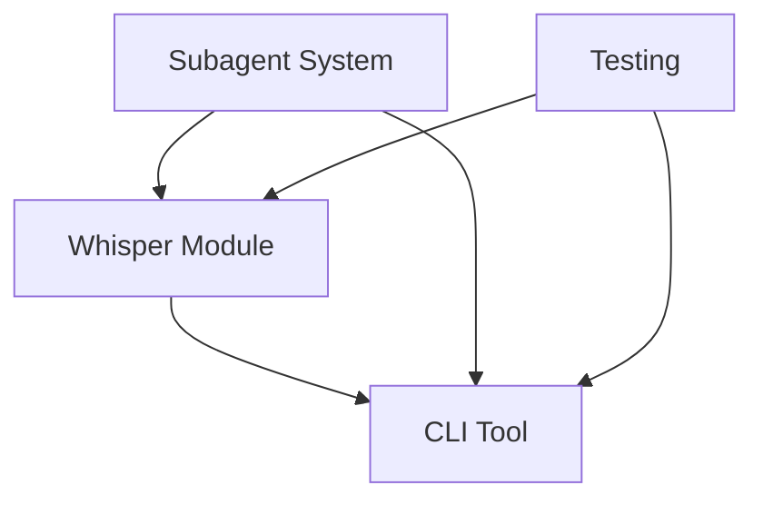

# Project List & Todos

## Active Projects

### 1. Groq Whisper Transcription Module
**Priority: 1 (Highest)**
**Status: In Development**
**Specification**: [whisper-spec.md](whisper-spec.md)

#### Todos:
- [x] Research Groq Whisper API capabilities
- [x] Document API specifications
- [ ] Implement core transcription module
  - [ ] Create `groq_cli/transcriber.py`
  - [ ] Add authentication handler
  - [ ] Implement file validation
  - [ ] Add transcription function
  - [ ] Parse API responses
  - [ ] Add output formatters
- [ ] Create test audio files
- [ ] Test with various formats and sizes
- [ ] Add error handling and retry logic
- [ ] Document usage examples

---

### 2. Groq CLI Tool
**Priority: 2**
**Status: Planning**
**Specification**: [cli-spec.md](cli-spec.md)

#### Todos:
- [x] Research CLI development best practices
- [x] Document CLI specifications
- [ ] Implement main CLI interface
  - [ ] Create `groq_cli/main.py`
  - [ ] Add Click command structure
  - [ ] Implement argument parsing
  - [ ] Add environment variable support
- [ ] Implement chat completion module
  - [ ] Create `groq_cli/chat.py`
  - [ ] Add streaming support
  - [ ] Implement interactive mode
  - [ ] Add Rich formatting
- [ ] Configure global installation
  - [ ] Test pip installation
  - [ ] Verify PATH registration
  - [ ] Create batch wrapper (optional)
- [ ] Test on Windows Terminal, PowerShell, CMD
- [ ] Create user documentation

---

### 3. Claude Code Subagent System
**Priority: 3**
**Status: Planning**

#### Todos:
- [x] Research Claude Code subagents for Windows
- [ ] Configure `.claude/agents/` structure
  - [ ] Create research agent configuration
  - [ ] Create testing agent configuration
  - [ ] Create summary agent configuration
- [ ] Implement hook system
  - [ ] Configure SubagentStop hook
  - [ ] Add summary generation logic
  - [ ] Set up `.claude/summaries/` output
- [ ] Test subagent invocation
- [ ] Document subagent usage patterns
- [ ] Create templates for common tasks

---

## Project Dependencies

## Timeline

### Week 1 (Current)
- ✅ Project setup and structure
- ✅ Research and documentation
- 🔄 Whisper module implementation
- ⏳ Initial testing

### Week 2
- ⏳ CLI tool development
- ⏳ Chat streaming implementation
- ⏳ Installation configuration
- ⏳ Windows compatibility testing

### Week 3
- ⏳ Subagent system setup
- ⏳ Hook implementation
- ⏳ Integration testing
- ⏳ Documentation completion

## Key Milestones

1. **Milestone 1**: First successful audio transcription via API
2. **Milestone 2**: Working `groq` command in terminal
3. **Milestone 3**: Streaming chat responses
4. **Milestone 4**: Subagent summary generation
5. **Milestone 5**: Complete documentation and testing

## Risk Mitigation

| Risk | Mitigation Strategy |
|------|-------------------|
| API rate limits | Implement exponential backoff and caching |
| Large file handling | Add chunking support for 100MB+ files |
| Windows path issues | Use pathlib exclusively |
| Installation problems | Provide multiple installation methods |
| Subagent context overflow | Generate summaries, use targeted agents |

## Success Metrics

- [ ] Transcribe 5 different audio formats successfully
- [ ] Stream chat responses at >100 tokens/second
- [ ] Global `groq` command works in all terminals
- [ ] Subagent summaries generated for all tasks
- [ ] Zero critical bugs in production use
- [ ] Complete documentation for all features

## Notes

- Whisper project takes priority as it's the primary use case
- CLI tool should be simple and intuitive for daily use
- Subagent system will help maintain clean context throughout development
- All code should follow Windows best practices
- Focus on reliability over advanced features initially